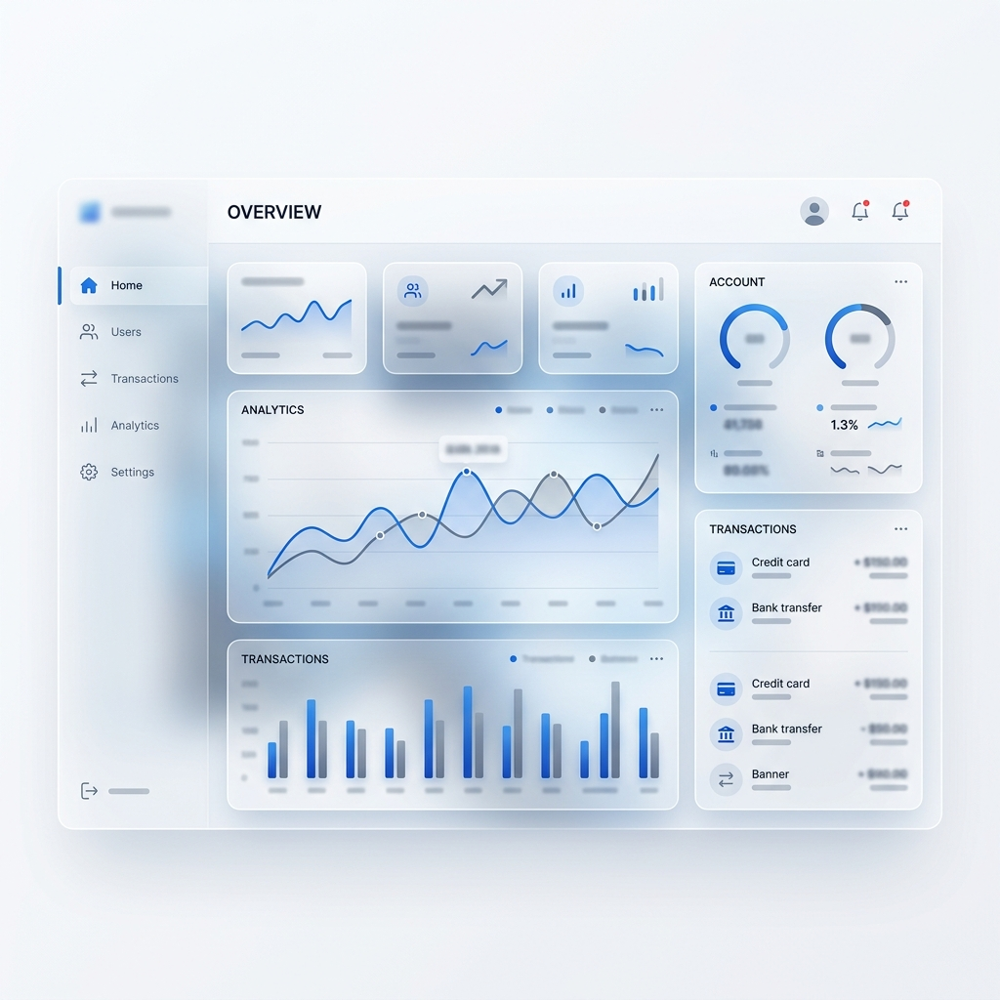

<p align="center">
  
</p>

# 🏦 Modern Banking System (Jakarta EE)

[](https://opensource.org/licenses/MIT)
[](https://www.oracle.com/java/)
[](https://jakarta.ee/)
[](https://maven.apache.org/)
[](https://www.mysql.com/)

A robust, modular, and secure enterprise-grade banking system built with **Jakarta EE 10**. This application features a comprehensive suite of banking operations, including user management, multi-type account handling, automated interest calculation, and scheduled transfers.

---

## 🌟 Key Features

### 👤 User & Role Management
- **Multi-level Access Control:** Super Admin, Admin, and User roles with granular permissions.
- **Secure Authentication:** Encrypted password storage and session-based security.
- **Profile Management:** Detailed user profiles with account status tracking.

### 💰 Financial Operations
- **Account Types:** Supports Savings, Checking, and Fixed Deposit accounts.
- **Transactions:** Seamless Deposit, Withdrawal, and Internal Transfer operations.
- **Interest Engine:** Automated monthly interest calculation and distribution using EJB Timer Services.
- **Scheduled Transfers:** Future-dated transfers with automated execution.

### 🛡️ Enterprise Security
- **Data Integrity:** ACID-compliant transactions with automatic rollbacks on failure.
- **Audit Logging:** Comprehensive logging of security events and financial transactions via EJB Interceptors.
- **Input Validation:** Robust protection against SQL injection and XSS.

---

## 🖼️ UI Showcase

<p align="center">
  <b>Admin Dashboard</b><br>
  
</p>

<p align="center">
  <b>User Interface</b><br>
  
</p>

---

## 🛠️ Technology Stack

| Layer | Technology |
| :--- | :--- |
| **Backend** | Java 17, Jakarta EE 10 (EJB, JPA, CDI) |
| **Frontend** | JSP, Servlets, Vanilla CSS |
| **Database** | MySQL / MariaDB |
| **Build Tool** | Apache Maven |
| **Server** | WildFly / GlassFish / Payara |

---

## 📂 Project Architecture

The system follows a modular **Enterprise Archive (EAR)** structure:

```text
Banking-System/
├── 🏗️ core/     # Business logic, JPA entities, and Services
├── 🔐 auth/     # Authentication and Session management
├── 💳 account/  # Account operations and Timer services
├── 🌐 web/      # Presentation layer (JSPs & Servlets)
└── 📦 ear/      # Enterprise Archive for deployment
```

---

## 🚀 Getting Started

### Prerequisites
- **Java 17** or higher
- **Maven 3.6+**
- **Jakarta EE 10** compatible application server (e.g., WildFly)
- **MySQL 8.0**

### 1. Database Setup
1. Create a database named `banking_system`.
2. Configure the connection in `core/src/main/resources/META-INF/persistence.xml`:
   ```xml
   <property name="jakarta.persistence.jdbc.url" value="jdbc:mysql://localhost:3306/banking_system"/>
   <property name="jakarta.persistence.jdbc.user" value="your_username"/>
   <property name="jakarta.persistence.jdbc.password" value="your_password"/>
   ```

### 2. Build & Deploy
```bash
# Clone the repository
git clone https://github.com/Hasith-Dissanayake/Banking-System.git

# Build the project
mvn clean package

# Deploy the EAR file
# Copy ear/target/Banking-System.ear to your server's deployment directory
```

### 3. Initial Configuration
- Navigate to `http://localhost:8080/banking-system/setup` to create the initial **Super Admin** account.
- Default access points:
  - **Admin Dashboard:** `/admin/`
  - **User Dashboard:** `/user/`

---

## 📊 Performance & Scalability
- **Stateless Architecture:** EJBs are designed to be stateless where possible for horizontal scaling.
- **Container Managed Transactions:** Ensures reliability and data consistency.
- **Optimized Queries:** Indexed database schema for fast transaction lookups.

---

## 📝 License
Distributed under the MIT License. See `LICENSE` for more information.

---

<p align="center">
  Developed for educational purposes as part of the BCU BCD 2 Assignment.
</p>